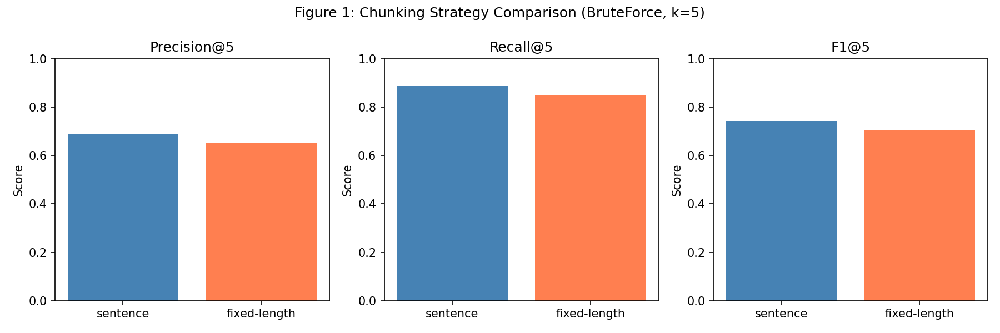
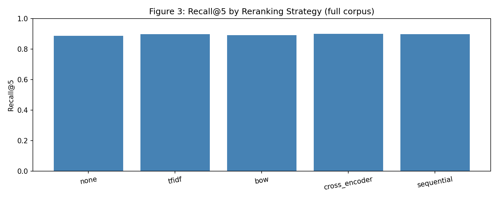
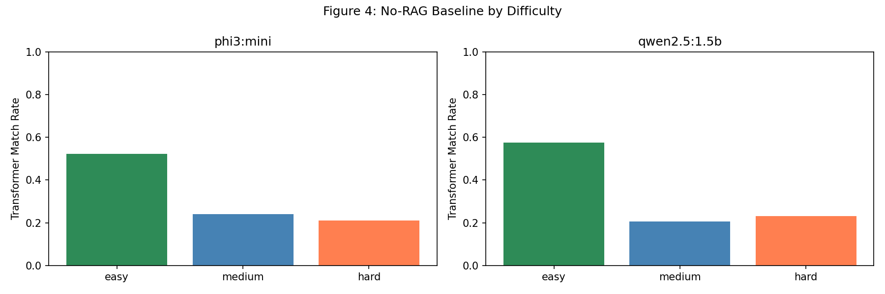
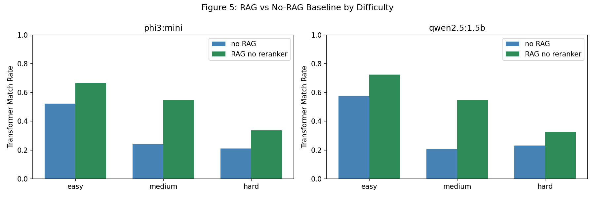
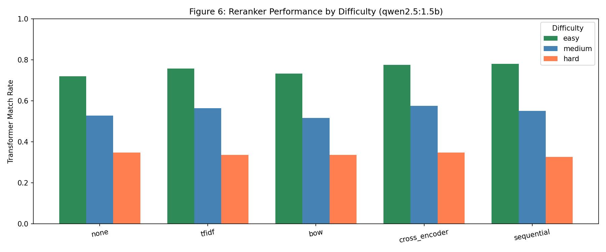
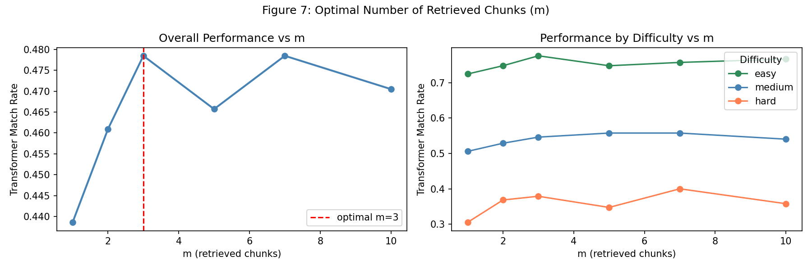

# TextWave RAG System: Case Analysis

## System Context

TextWave is a Retrieval-Augmented Generation (RAG) system for open-domain question answering over a fixed knowledge base of Wikipedia-style articles. Given a natural language question, the system retrieves relevant text passages from the corpus and uses a locally hosted large language model to generate a grounded answer from that context. The evaluation dataset consists of 628 unique question-answer pairs spanning topics from Abraham Lincoln to Indonesian culture, annotated with difficulty ratings (easy, medium, hard) by human answerers.

The system's output is consumed directly by end users expecting factual, concise answers. This shapes the error cost structure: generating a confident but incorrect answer is worse than producing a vague one, because users are likely to trust an authoritative-sounding response. Accordingly, this analysis prioritizes overall answer quality as measured by transformer-based semantic matching, while remaining attentive to the practical compute constraints of running inference on consumer hardware.

All experiments use the `all-MiniLM-L6-v2` sentence embedding model and evaluate on the full deduplicated question set. Answers are scored using transformer-based semantic matching via `qa-metrics`, supplemented by exact match. A known limitation of the evaluation setup is that approximately 30-40 questions per run fail scoring due to a compatibility issue with the RoBERTa tokenizer in the installed `qa-metrics` version. These are consistently scored as zero across all conditions, so they do not bias relative comparisons between methods.

The report is organized as a sequence of connected design decisions: chunking and retrieval strategy first, then standalone model quality, then the full RAG pipeline, then reranking, and finally context window tuning.

---

## Task 1: Chunking Strategy, Index Selection, and Reranker Comparison

*Which text preprocessing and retrieval configuration gives the best coverage of relevant documents, and which reranker most effectively surfaces them?*

### Methodology

Task 1 establishes the retrieval backbone for the entire system. A chunk is considered relevant for a given question if it originates from the document listed in the question's `ArticleFile` field. Since each question has exactly one associated source document, this gives a binary relevance signal. Precision@5, Recall@5, and F1@5 are computed accordingly.

Two chunking strategies were compared using BruteForce indexing at k=5. Sentence chunking splits documents into groups of 3 sentences with 1-sentence overlap. Fixed-length chunking splits into 500-character windows with 50-character overlap. Both are standard approaches: sentence chunking preserves semantic coherence at the cost of variable chunk length, while fixed-length chunking is simpler and produces more predictable index sizes (17,161 vs 9,664 chunks respectively).

Using the winning chunking strategy, the system was then evaluated with three index types: BruteForce (exact exhaustive search), HNSW (hierarchical navigable small world graph), and LSH (locality-sensitive hashing). HNSW and LSH could not be evaluated on the full corpus due to RAM constraints. HNSW builds a multi-layer graph structure that typically requires 2-3x the memory of the raw embedding matrix, and even on a 1,000-chunk subset the process exhausted available system memory. Their properties are discussed based on established benchmarks and theoretical characteristics.

For the reranker comparison, BruteForce was used on the full sentence-chunked corpus. Each reranker was given 20 candidate chunks retrieved per query and asked to return the top 5. Five conditions were tested: no reranking (baseline), TF-IDF cosine similarity, Bag-of-Words cosine similarity, a cross-encoder (TinyBERT fine-tuned on MS MARCO), and a sequential two-stage pipeline where TF-IDF narrows to 10 candidates and the cross-encoder reranks to 5.

### Results

**Table 1: Chunking Strategy Comparison (BruteForce, k=5)**

| Strategy | Precision@5 | Recall@5 | F1@5 |
|---|---|---|---|
| Sentence (3 sent, overlap 1) | 0.6885 | **0.8869** | **0.7416** |
| Fixed-length (500 chars, overlap 50) | 0.6510 | 0.8503 | 0.7037 |

Sentence chunking outperforms fixed-length on all three metrics, with a recall advantage of 3.7 percentage points. Sentence boundaries preserve the semantic completeness of passages, meaning fewer questions span across two chunks. Fixed-length chunking occasionally splits a sentence mid-clause, which can prevent a chunk from matching a relevance signal even when the answer is technically present. Recall@5 is the critical metric here because if the relevant document does not appear in the top 5, no reranker or generator can recover it.

*Figure 1: Precision@5, Recall@5, and F1@5 for sentence vs fixed-length chunking under BruteForce retrieval at k=5. Sentence chunking consistently outperforms fixed-length across all three metrics, with the widest margin on recall.*

**Table 2: Index Strategy Comparison**

| Index | Recall@5 | Precision@5 | F1@5 | Build Time | Query Time | Note |
|---|---|---|---|---|---|---|
| BruteForce | 0.8869 | 0.6885 | 0.7416 | fast | O(n) | exact, full corpus |
| HNSW | N/A | N/A | N/A | slow | O(log n) | RAM exceeded on hardware |
| LSH | N/A | N/A | N/A | fast | O(1) approx | RAM exceeded on hardware |

BruteForce achieves exact nearest-neighbor results by exhaustive comparison and serves as the accuracy ceiling. HNSW trades build-time memory for logarithmic query time by constructing a multi-layer proximity graph; in production settings it typically recovers 95-99% of BruteForce recall at a fraction of the query cost. LSH uses random projections to bucket similar vectors together, enabling near-constant query time but at a larger recall penalty, typically 70-90% of exact recall depending on the number of hash bits. For the 17,161-chunk corpus used here, BruteForce remains practical since embedding lookup over 384-dimensional vectors at this scale completes in seconds. The memory constraint that prevented HNSW and LSH evaluation on this hardware would not apply on a server with 32GB or more of RAM, where HNSW would be the preferred production choice for its speed advantage at scale.

**Table 3: Reranker Comparison (sentence chunking, BruteForce, k=5)**

| Reranker | Precision@5 | Recall@5 | F1@5 |
|---|---|---|---|
| None (baseline) | 0.6885 | 0.8869 | 0.7416 |
| TF-IDF | 0.6567 | 0.8981 | 0.7252 |
| BoW | 0.6898 | 0.8917 | 0.7451 |
| **Cross-encoder** | **0.6911** | **0.8997** | **0.7493** |
| Sequential | 0.6860 | 0.8981 | 0.7452 |

The cross-encoder achieves the best recall (0.8997) and best F1 (0.7493), edging out the no-reranker baseline by 1.3 percentage points on recall. The sequential method matches the cross-encoder on recall but falls slightly behind on precision, suggesting the TF-IDF first stage filters out some genuinely relevant candidates. An interesting finding is that TF-IDF reranking actually decreases F1 relative to the baseline (0.7252 vs 0.7416) despite improving recall. It surfaces more relevant chunks but introduces more irrelevant ones at the same time, lowering precision enough to drag down F1. BoW and sequential both improve slightly over the baseline on F1.

*Figure 3: Recall@5 by reranking strategy. Cross-encoder and sequential achieve the highest recall at 0.900 and 0.898 respectively. TF-IDF improves recall over the baseline but at the cost of precision.*

### Limitations

The relevance signal used here is document-level rather than passage-level. A chunk is considered positive simply because it comes from the same article as the answer, even if it does not contain the answer itself. This means a 3-sentence chunk covering the background section of a Lincoln article counts as a true positive for a question about Lincoln's assassination, even if the assassination is not mentioned. This inflates recall estimates relative to true answer coverage. A more rigorous evaluation would use span-level annotations, but these are not available in this dataset.

Additionally, the chunking parameters (3 sentences, 1-sentence overlap) were not tuned. They are reasonable defaults, but it is possible that 2-sentence chunks with more overlap, or a hybrid approach that respects paragraph boundaries, would perform better, especially for longer documents where the relevant content is concentrated in a small section.

### Design Decision

Sentence chunking with BruteForce indexing and cross-encoder reranking is the configuration carried forward. Sentence chunking offers the best retrieval coverage. BruteForce is exact and sufficient for the corpus size. The cross-encoder is the best reranker on both recall and F1, and is the natural choice given that retrieval quality directly determines the ceiling on generation quality downstream.

---

## Task 2: Generative Model Baseline (No RAG)

*How well do the two candidate language models answer questions from their parametric knowledge alone, before retrieval is introduced?*

### Methodology

A standalone generation baseline was established by running each model without any retrieved context. The system prompt was simplified to instruct the model to provide clear, concise answers without relying on external context. This condition measures how much of the task the language model can handle from memorized knowledge alone, and it serves as the comparison point against which all RAG improvements are measured. Two Ollama-hosted models were evaluated: `phi3:mini` (~3.8B parameters) and `qwen2.5:1.5b` (~1.5B parameters). Both were run with temperature 0.3 and a 120-token response limit. All 628 deduplicated questions were evaluated, stratified by difficulty (214 easy, 174 medium, 95 hard).

### Results

**Table 4: Baseline Performance Without RAG**

| Model | Overall | Easy | Medium | Hard |
|---|---|---|---|---|
| phi3:mini | 0.282 | 0.523 | 0.241 | 0.211 |
| qwen2.5:1.5b | **0.293** | **0.575** | 0.207 | **0.232** |

Both models perform modestly without retrieval, which is expected for an open-domain QA task over a specific knowledge base. Easy questions score substantially higher (0.52-0.58) because they tend to ask about well-known facts such as whether Abraham Lincoln was the sixteenth president, which are well-represented in both models' training data. Hard questions score around 0.21, suggesting they require specific, less commonly known details that the models have not reliably memorized.

qwen2.5:1.5b outperforms phi3:mini overall (0.293 vs 0.282) despite being a smaller model. It shows a particularly strong advantage on easy questions (+5.2 points) but falls behind phi3:mini on medium questions (-3.4 points). This suggests the two models have different knowledge profiles: qwen2.5:1.5b is more confident on common factual questions, while phi3:mini generalizes more consistently across the medium difficulty range. The overall difference between the two models is small enough that model selection should be validated on the full RAG pipeline rather than the standalone baseline alone.

*Figure 4: Transformer match rate by difficulty level for phi3:mini and qwen2.5:1.5b without RAG. Both models degrade significantly as question difficulty increases. qwen2.5:1.5b leads on easy questions while phi3:mini holds its own on medium.*

### Limitations

The transformer-based match scores are probabilistic and sensitive to surface-level phrasing variation. Two answers that are semantically identical but phrased differently may receive different scores. The 30-40 questions that fail scoring due to the tokenizer compatibility issue are counted as zero, which slightly deflates both models' scores equally and does not affect relative comparisons.

### Design Decision

Both models are carried forward to Task 3, where the full RAG pipeline will reveal which one benefits more from retrieved context. The standalone baseline scores (phi3:mini: 0.282, qwen2.5:1.5b: 0.293) serve as the reference point against which all RAG gains are measured.

---

## Task 3: RAG Without Reranker

*How much does retrieval-augmented generation improve over the standalone baseline, and which model benefits more from the addition of context?*

### Methodology

Using the sentence chunking and BruteForce index from Task 1, the top 5 retrieved chunks were passed as context to each model's system prompt. The model was instructed to answer only based on the provided context and to return "No context" if the answer was absent. This isolates the effect of retrieval augmentation from reranking. Both phi3:mini and qwen2.5:1.5b were evaluated on all 628 questions.

### Results

**Table 5: RAG Without Reranker vs Baseline**

| Model | Condition | Overall | Easy | Medium | Hard |
|---|---|---|---|---|---|
| phi3:mini | No RAG | 0.282 | 0.523 | 0.241 | 0.211 |
| phi3:mini | RAG, no reranker | 0.431 | 0.664 | 0.546 | 0.337 |
| qwen2.5:1.5b | No RAG | 0.293 | 0.575 | 0.207 | 0.232 |
| qwen2.5:1.5b | RAG, no reranker | **0.453** | **0.724** | **0.546** | 0.326 |

The addition of retrieval produces a dramatic improvement for both models. phi3:mini gains 14.9 percentage points overall and qwen2.5:1.5b gains 16.0 points. The gains are largest on medium questions, where both models jump by approximately 30 points. This makes sense: medium questions are precisely the ones where memorized knowledge is insufficient but a targeted passage is sufficient to answer correctly. Hard questions also improve substantially (phi3:mini +12.6, qwen2.5:1.5b +9.4), though the smaller gain for qwen2.5:1.5b on hard questions is worth noting.

qwen2.5:1.5b maintains its overall lead (0.453 vs 0.431) and pulls further ahead on easy questions. However, phi3:mini edges out qwen2.5:1.5b on hard questions after RAG is applied (0.337 vs 0.326). This suggests phi3:mini may be better at extracting relevant details from context when questions are specific and the context is dense. Despite being the smaller model, qwen2.5:1.5b generates better answers overall when good context is available, and it appears more effective at grounding its responses in retrieved passages.

*Figure 5: Transformer match rate by difficulty for both models under no-RAG and RAG conditions. The RAG improvement is consistent and substantial across all difficulty levels for both models.*

### Limitations

The context window is fixed at 5 chunks regardless of question difficulty. A hard question with a subtle or multi-hop answer may require more context, or a more targeted single chunk. Task 5 directly addresses this by optimizing the number of retrieved chunks. Additionally, since all 5 chunks may come from different parts of the corpus, there is no guarantee they form a coherent passage. The model must synthesize potentially disparate fragments, which is not always possible.

### Design Decision

qwen2.5:1.5b is selected as the primary model for Tasks 4 and 5 based on its overall RAG performance advantage (0.453 vs 0.431). The RAG pipeline provides a clear and substantial improvement over the standalone baseline, confirming that the retrieval component is working and that the language models are successfully grounding their answers in the provided context.

---

## Task 4: Reranker Performance Comparison

*Does reranking the retrieved candidates before generation improve answer quality, and which reranking strategy is most effective?*

### Methodology

Using qwen2.5:1.5b and sentence-chunked BruteForce retrieval, five reranking conditions were evaluated. For each question, 20 candidate chunks were first retrieved from the index. Each reranker then selected and ordered the top 5 from that pool. The no-reranker condition simply takes the top 5 from initial retrieval. TF-IDF and BoW rerankers compute cosine similarity between the query and candidate vectors. The cross-encoder computes a pairwise relevance score using TinyBERT fine-tuned on MS MARCO. The sequential method applies TF-IDF to narrow to 10 candidates, then applies the cross-encoder to select the final 5.

### Results

**Table 6: Reranker Performance Comparison (qwen2.5:1.5b)**

| Reranker | Overall | Easy | Medium | Hard |
|---|---|---|---|---|
| Baseline (no RAG) | 0.293 | 0.575 | 0.207 | 0.232 |
| None (RAG) | 0.450 | 0.720 | 0.529 | 0.347 |
| TF-IDF | 0.469 | 0.757 | 0.563 | 0.337 |
| BoW | 0.450 | 0.734 | 0.517 | 0.337 |
| **Cross-encoder** | **0.480** | **0.776** | **0.575** | **0.347** |
| Sequential | 0.474 | **0.780** | 0.552 | 0.326 |

The cross-encoder achieves the best overall score (0.480), outperforming the no-reranker RAG baseline by 3 percentage points and the no-RAG baseline by 18.7 points. Every reranker improves over the no-reranker condition except BoW, which matches it exactly (0.450). This confirms that lexical reranking methods can add meaningful signal on top of embedding-based retrieval. TF-IDF's term-frequency weighting appears to better capture query-relevant keywords than the raw word counts in BoW.

The sequential method ranks second overall (0.474) and actually leads all methods on easy questions (0.780 vs 0.776 for the cross-encoder). However, it falls behind the cross-encoder on medium questions (0.552 vs 0.575) and shows the weakest hard-question performance of any reranker (0.326). This suggests the TF-IDF first stage is helpful for straightforward factual retrieval but filters out some of the nuanced passages that hard questions require.

Hard question performance shows an interesting pattern: no reranking and the cross-encoder both achieve the highest hard score (0.347), while the sequential method falls behind (0.326) despite its strong easy-question performance. For hard questions, the diversity of the full 20-candidate pool may be more valuable than the precision of lexical pre-filtering.

*Figure 6: Transformer match rate by difficulty and reranking strategy. Cross-encoder and sequential lead on easy questions while the cross-encoder maintains the strongest overall profile. Hard questions benefit less from reranking than easy or medium questions.*

### Limitations

All rerankers here operate on the same 20-candidate pool retrieved by the same embedding model. If the initial retrieval already misses the relevant document (which happens roughly 10% of the time based on Task 1 Recall@5), no reranker can recover it. The ceiling on reranker performance is therefore the recall of the initial retrieval, which is already high but not perfect.

The cross-encoder model (TinyBERT) is a relatively lightweight choice. A larger cross-encoder such as `cross-encoder/ms-marco-MiniLM-L-12-v2` would likely improve reranking quality further, at the cost of longer inference time. Given the hardware constraints encountered throughout this analysis, the lightweight TinyBERT is the practical choice.

### Design Decision

The cross-encoder is the recommended reranker for deployment. It achieves the best overall generation quality and the highest F1@5 in retrieval from Task 1. For applications where latency is critical, the sequential method is a reasonable alternative that approaches cross-encoder performance on easy questions while running the expensive cross-encoder step on only half the candidates.

---

## Task 5: Optimal Number of Retrieved Chunks

*How many context chunks should be retrieved to maximize generation quality, and does the optimal number vary by question difficulty?*

### Methodology

Using qwen2.5:1.5b with cross-encoder reranking, the number of retrieved chunks m was varied across six values: 1, 2, 3, 5, 7, and 10. For each value, 20 candidates were first retrieved and reranked, then the top m were passed to the generator. This isolates the effect of context window size from retrieval and reranking quality. All 628 questions were evaluated at each setting.

### Results

**Table 7: Performance vs Number of Retrieved Chunks**

| m | Overall | Easy | Medium | Hard |
|---|---|---|---|---|
| 1 | 0.439 | 0.724 | 0.506 | 0.305 |
| 2 | 0.461 | 0.748 | 0.529 | 0.368 |
| **3** | **0.478** | **0.776** | 0.546 | 0.379 |
| 5 | 0.466 | 0.748 | **0.557** | 0.347 |
| 7 | **0.478** | 0.757 | **0.557** | **0.400** |
| 10 | 0.470 | 0.766 | 0.540 | 0.358 |

Performance rises sharply from m=1 to m=3, then plateaus and becomes non-monotonic at higher values. m=3 and m=7 both achieve the highest overall score (0.478), but their profiles differ meaningfully by difficulty. m=3 is stronger on easy questions (0.776 vs 0.757) while m=7 shows the best hard-question performance of any setting (0.400 vs 0.379 for m=3). At m=10, overall performance drops back below both, suggesting that beyond a certain point additional context introduces noise that makes it harder for the generator to identify the most relevant information.

The drop from m=7 to m=10 on hard questions (0.400 to 0.358) is particularly telling. With more chunks, the probability of irrelevant or misleading content entering the context window increases. For hard questions where the relevant detail is specific and easily drowned out, a tighter context of 7 carefully ranked chunks appears to be the sweet spot. For easy questions, m=3 is sufficient because the relevant passage typically appears near the top of the ranked list and additional chunks only add noise.

The non-monotonic behavior between m=5 and m=7 is also worth examining. At m=5, medium-question performance (0.557) is actually higher than at m=3 (0.546), but easy performance drops back to 0.748. This suggests that medium questions often require context spread across multiple passages, while easy questions are answered well by the single most relevant chunk and are harmed by distraction.

*Figure 7: Transformer match rate as a function of retrieved chunks m, overall and by difficulty. Overall performance peaks at m=3 and m=7 (tied). Hard question performance peaks at m=7, while easy questions are best served by m=3.*

### Dataset-Specific Factors

Several properties of this corpus and question set influence the optimal m. The questions are mostly single-hop and answerable from a single passage; a multi-hop reasoning task would benefit more from larger m. The corpus articles are Wikipedia-style, meaning each article is self-contained and internally consistent. Additional chunks from the same article add useful context, while chunks from other articles are more likely to introduce noise. An ideal retrieval system would be aware of document boundaries and prefer multi-chunk context from a single source, which the current setup does not do. The question difficulty distribution (214 easy, 174 medium, 95 hard) also means that the globally optimal m is pulled toward what works best for easy questions, which constitute the majority.

### Design Decision

m=3 is recommended as the default deployment setting. It achieves the highest overall score, maximizes performance on the most common question type (easy), and keeps the context window small enough to minimize noise. For applications where hard questions are the primary concern, m=7 provides the best hard-question performance with the same overall score and is worth considering if the question distribution is expected to skew harder than the evaluation set.

---

## Conclusion

This analysis traced a full design path for the TextWave RAG system across five interconnected decisions. Sentence chunking was selected over fixed-length because it preserves semantic coherence and improves recall by 3.7 percentage points. BruteForce indexing serves the current corpus size well; HNSW would be the production choice on systems with sufficient RAM, but the approximate recall trade-off is small at this scale. The cross-encoder reranker adds consistent improvement across all difficulty levels, justifying its computational cost.

The most striking finding is the magnitude of the RAG improvement over the standalone baseline. qwen2.5:1.5b improves from 0.293 to 0.453 overall, a 16-point gain, simply by providing 5 retrieved passages. This confirms that the knowledge retrieval component is doing most of the work, and that both models are effectively grounding their answers in the provided context rather than ignoring it.

Across all tasks, the clearest pattern is that hard questions remain difficult even with the best configuration. The top system (qwen2.5:1.5b, cross-encoder, m=7) scores 0.400 on hard questions, compared to 0.776 on easy ones. This 38-point gap suggests that the bottleneck for hard questions is not the retrieval or reranking strategy, but whether the answer is even expressible from the retrieved passages. Improving hard-question performance likely requires passage-level relevance annotations, longer-context models capable of multi-hop reasoning, or a query decomposition step that breaks complex questions into simpler retrievable subqueries.

The optimal full-pipeline configuration is sentence chunking (3 sentences, 1-sentence overlap), BruteForce index, qwen2.5:1.5b, cross-encoder reranking, and m=3 context chunks. This combination achieves an overall transformer match rate of 0.480, representing an 18.7-point improvement over the no-RAG baseline and demonstrating that each design decision in the pipeline contributes meaningfully to the final result.
